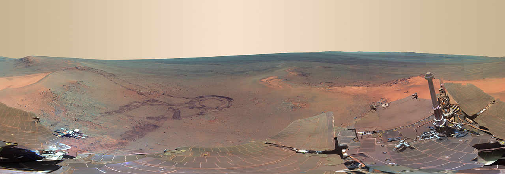
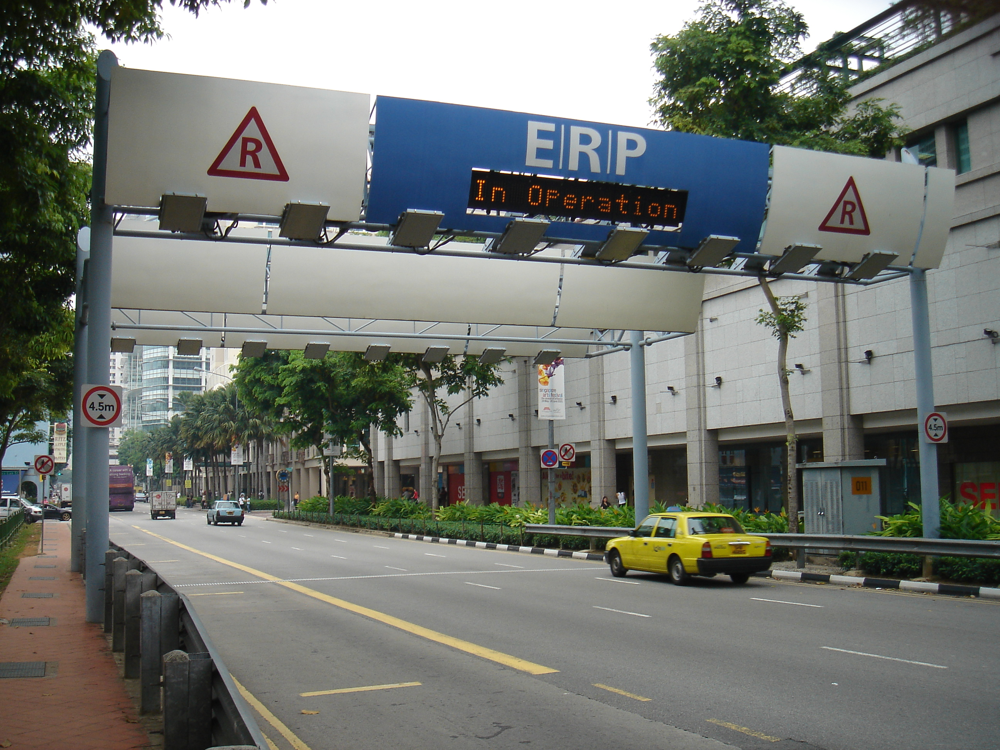

Virtuelle Realitäten und das Internet der Dinge
===============================================

### Das Höhlengleichnis Platons {#das-höhlengleichnis-platons .next}

---

### 

---

### Abgrenzung der Begriffe

-   In die computergenerierte, virtuelle Realität taucht der Nutzer so
    vollständig wie möglich ein (z.B. VR-Headset).
-   Die erweiterte Realität ergänzt die Wahrnehmung mit
    computergenerierten Zusatzinformationen.
-   Das Internet der Dinge bindet Gegenstände ins Internet ein und macht
    ihre Eigenschaften somit auch für virtuelle bzw. erweiterte
    Realitäten verfügbar.

---

Konstruktion und Wahrnehmung virtueller Welten
==============================================

---

### Stereoskopie und Raumbildaufnahmen

---

### Stereoskopie und Raumbildaufnahmen

-   Bau und Verwendung eines Stereoskops zur Betrachtung von
    Raumbildaufnahmen
-   Bau und Verwendung einer einfachen VR-Brille (google cardboard)
-   Virtueller Rundgang durch die Schule

---

### Panorama- und 360°-Aufnahmen

[360°-Aufnahmen eines
Mars-Rovers](https://www.360cities.net/image/curiosity-rover-martian-solar-day-2)

---

### Panorama- und 360°-Aufnahmen

-   Aufnahme, Zusammenfügen und Präsentation von Einzelbildern zu
    Panorama-/360°-Aufnahmen
-   Erstellen eines Planetariums für die Sternwarte
-   Anschauliche Tutorial-Videos: z.B. Bau eines Modellmotors

---

Vernetzung von Gegenständen
===========================

---

### Anbringen und programmieren benötigter Hardware

Eine ERP-Stelle in Singapur (Electronic Road Pricing)

---

### Anbringen und programmieren benötigter Hardware

-   Umweltsensoren für eine Wetterstation
-   Messung von Körperfunktionen (medizinische
    Anwendung, Fitnesstracker)
-   Ein Knopf, viele Möglichkeiten: Türklingel, Notfallknopf, Aktivieren
    eines Sprachassisstenten
-   RFID - Registrieren über Radiowellen

---

### Verarbeitung und Präsentation der gewonnenen Daten

-   Aufbau einer drahtgebundenen bzw. drahtlosen Infrastruktur
-   Einholen, verknüpfen und darstellen gewonnener Daten

---

Ende!
=====

